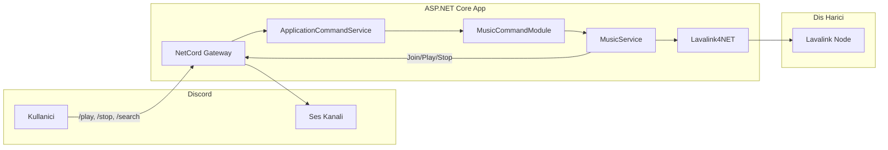

# Müzik Botu – Komutlar ve Lavalink Entegrasyonu Planı

Bu plan, [PLAN.MD](PLAN.MD) içindeki teknik stack ve kurallara uygun olarak **sadece slash komutları** (/play, /stop, /search) ve **Lavalink ile tek parça çalma** (şimdilik kuyruk yok) için net bir uygulama yol haritası sunar.

---

## 1. Komut Modeli Kararı

PLAN.MD’deki "Slash Commands" tercihine sadık kalınıyor.

- **Komut tipi:** Sadece **slash (application) komutları**. Prefix komut eklenmeyecek.
- **NetCord:** `ApplicationCommandModule<ApplicationCommandContext>`, `[SlashCommand("play", "…")]` vb. kullanılacak.
- **Kayıt:** `AddApplicationCommands()` + `AddModules(host, assembly)` ile modül yüklenecek. Slash komut isimleri küçük harf olmalı (Discord kuralı).

---

## 2. Komut Davranışları (Kuyruk Yok)

| Komut                                                    | Davranış                                                                                                                                                                                                                                                       |
| -------------------------------------------------------- | -------------------------------------------------------------------------------------------------------------------------------------------------------------------------------------------------------------------------------------------------------------- |
| **/play** (zorunlu parametre: `query` – sorgu veya link) | Kullanıcı bir ses kanalında olmalı. Bot aynı kanala girer. Lavalink’te arama yapılır (YT veya link; Spotify için Lavasrc gerekir). Bulunan ilk parça (veya link’ten çözülen parça) **hemen çalınır**; kuyruk yok, önceki parça varsa durdurulup yenisi başlar. |
| **/stop**                                                | O anda çalınan parçayı durdurur; player durur (tek parça modelinde “kuyruk temizle” anlamına da gelir).                                                                                                                                                        |
| **/search** (zorunlu parametre: `query`)                 | Lavalink’te arama yapar; sonuçları (ör. ilk 5–10 parça) başlık + süre ile listeler; “Çalmak için /play ile şu linki kullan” benzeri bilgi verir. Çalmaz, sadece listeler.                                                                                      |

**Not:** “Bla bla” gibi metin verildiğinde Lavalink tarafında **YouTube** (veya sunucuda yapılandırılmışsa **Spotify/Lavasrc**) ile arama yapılacak. Spotify’ın çalışması için Lavalink sunucusunda **Lavasrc** (veya benzeri) eklentisi ve gerekli API anahtarlarının olması gerekir; bot kodu sadece arama/çalma isteğini Lavalink’e gönderir.

---

## 3. Mimari Özet (PLAN.MD ile Uyumlu)

- **BotHostedService:** Gateway’i başlatır, uygulama ayağa kalkarken bot çalışır (PLAN.MD’deki gibi).
- **MusicService:** Lavalink4NET’in `IAudioService` (ve gerekirse `ITrackManager`) kullanımını sarmalar; **Join, Play, Stop, Search** işlemleri burada.
- **MusicCommandModule:** `ApplicationCommandModule<ApplicationCommandContext>`. `/play`, `/stop`, `/search` slash komutları bu modülde `[SlashCommand]` ile tanımlanır; iş mantığı için `MusicService` çağrılır.
- **Kuyruk:** Şimdilik yok; `MusicService` tek parça çalma (play = mevcut varsa stop + yeni track play) olarak tasarlanır.

---

## 4. Uygulama Sırası ve Dosya Yerleşimi

Aşağıdaki sıra, PLAN.MD’deki “Execution Step” ile uyumludur; önce config ve Program.cs, sonra Services, sonra komutlar ve API.

### 4.1 Konfigürasyon (Program.cs + appsettings.json)

- **appsettings.json:**  
  - NetCord token, intents (Gateway için). Prefix tanımı yok (sadece slash komut).  
  - Lavalink: host, port, password.  
  - JWT (AuthController için).
- **Program.cs:**  
  - NetCord Gateway + **AddApplicationCommands()** (slash komutları için).  
  - Lavalink4NET.NetCord servisleri (AddLavalink vs.).  
  - JWT + Swagger.  
  - **AddModules(host, assembly)** ile `MusicCommandModule` (ApplicationCommandModule) yüklenecek.

### 4.2 Services Klasörü

- **BotHostedService:**  
  - `IHostedService`. Gateway client’ı başlatır, durdurmada kapatır. Komutların çalışması için NetCord’un message/command pipeline’ı bu Gateway üzerinden tetiklenecek şekilde ayarlanır (NetCord.Hosting ile genelde otomatik gelir).
- **MusicService (somut sınıf):**  
  - Lavalink4NET’ten `IAudioService` inject edilir.  
  - Metotlar (senaryoya göre isimlendirilebilir):  
    - **JoinAsync:** Kullanıcının bulunduğu ses kanalına botu bağlar (Lavalink4NET NetCord entegrasyonunda guild + channel bilgisi ile).  
    - **PlayAsync(guildId, queryOrUrl):** Önce `GetTrackAsync` veya `LoadTracksAsync` ile arama/link çözümleme (YouTube / Spotify vb. Lavalink’te ne destekleniyorsa). Sonra guild için player al (yoksa oluştur), gerekirse join, ardından **tek parça** çal (mevcut çalma varsa stop edip yeni track’i play).  
    - **StopAsync(guildId):** Guild player’ı al, stop.  
    - **SearchAsync(query, limit):** Arama yap, track listesini döndür (liste komutlarda kullanılacak).
  - Arayüz (IMusicService) PLAN.MD’de “do not over-abstract” kuralına göre **zorunlu değil**; tek implementasyon varsa doğrudan `MusicService` inject edilebilir.

### 4.3 Slash Komut Modülü

- **MusicCommandModule:** `ApplicationCommandModule<ApplicationCommandContext>`.  
  - **/play** (parametre: `query` – string, zorunlu):  
    - Context’ten guild + kullanıcının ses kanalı alınır. Kullanıcı ses kanalında değilse “Lütfen bir ses kanalına girin” benzeri ephemeral yanıt.  
    - `MusicService.JoinAsync` (gerekirse) + `MusicService.PlayAsync(guildId, query)`.  
    - Sonuç: “Çalıyor: …” veya “Bulunamadı / çalınamadı” mesajı (Followup veya Respond ile).
  - **/stop:**  
    - `MusicService.StopAsync(guildId)`. “Durduruldu” mesajı.
  - **/search** (parametre: `query` – string, zorunlu):  
    - `MusicService.SearchAsync(query, 10)` (veya 5). Dönen listeyi embed veya metin olarak yaz; “Çalmak için /play ile link kullan” bilgisi ver.

Komutlar **async** olabilir; slash komut parametreleri NetCord’da method parametreleri ile tanımlanır (örn. `string query`). Gerekirse `RespondAsync` / `FollowupAsync` ile yanıt verilir.

### 4.4 Lavalink Arama / Kaynak Seçimi

- **/play** ve **/search** için:  
  - Girdi **URL** ise (YouTube, Spotify, vb.): Doğrudan Lavalink’e “load tracks” ile gönder; çözümleme Lavalink (ve Lavasrc) tarafında olur.  
  - Girdi **düz metin** ise: Lavalink’te **YouTube** ile arama (ör. `GetTrackAsync(query, SearchMode.YouTube)` veya LoadTracks ile `ytsearch:` prefix’i). Spotify araması için sunucuda Lavasrc varsa ilgili search mode kullanılabilir; yoksa sadece YT ile devam edilir.
- Bot tarafında “tercihen YT ya da Spotify” = konfigüre edilebilir default search source (ör. appsettings’te `Lavalink:DefaultSearchMode`) yapılabilir; ilk aşamada sabit YouTube da yeterli.

### 4.5 Web API (PLAN.MD’deki gibi)

- **AuthController:** JWT token üretir (hardcoded credentials ile).  
- **BotStatusController:** `[Authorize]` ile bot istatistikleri (connected guilds, voice connections, uptime, latency).  
- Müzik botu komutları sadece Discord üzerinden; API’de ekstra “play/stop” endpoint’i bu planda yok (istersen sonra eklenebilir).

### 4.6 Dokümantasyon

- API dokümantasyonu: Swagger ile güncel tutulacak; her değişiklikte doc’un güncellenmesi PLAN.MD’de belirtildiği için, Auth ve BotStatus endpoint’leri açıklanacak.

---

## 5. Kısa Özet

- **Komutlar:** Sadece slash: `/play`, `/stop`, `/search`; hepsi `ApplicationCommandModule<ApplicationCommandContext>` türevi `MusicCommandModule` içinde, iş mantığı `MusicService`’te.  
- **Müzik akışı:** Lavalink4NET ile join/play/stop; arama ve link çözümleme Lavalink (YT; isteğe Spotify için Lavasrc) tarafında.  
- **Kuyruk:** Yok; play her zaman tek parça çalar, stop mevcut çalmayı durdurur.  
- **Dosyalar:** `Program.cs`, `appsettings.json`, `Services/BotHostedService.cs`, `Services/MusicService.cs`, `Services/MusicCommandModule.cs` (slash modülü), `Controllers/AuthController.cs`, `Controllers/BotStatusController.cs`; API doc (Swagger) güncel tutulacak.

Bu plan, mevcut PLAN.MD’yi bozmadan müzik botu komutlarını sadece slash komutlarla ve Lavalink entegrasyonunu tek parça çalma modeliyle netleştirir. İstersen bir sonraki adımda kuyruk ve /skip, /queue komutları için ayrı bir genişleme planı çıkarılabilir.